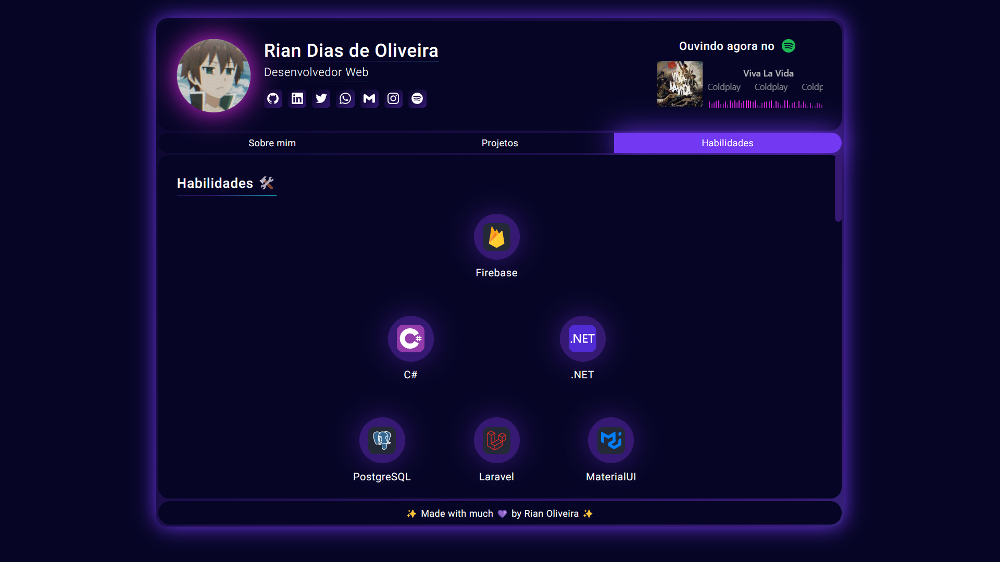

  <h1>🚀 Portfólio 🚀</h1>

## 📚 Sobre

Meu portfólio pessoal, com informações sobre mim, tecnologias que utilizo, meus projetos e links para minhas redes sociais.

## 📝 Notas

Desenvolvido inicialmente em abril de 2022 e atualizado para sua segunda versão em maio de 2023.

## 🔎 Demonstração

  

## 💻 Como acessar

A aplicação está hospedada na **Vercel** e pode ser acessada [aqui](https://portfolio-omega-murex-81.vercel.app/).

## 🛠️ Tecnologias utilizadas

 

<table align="center">
  <tbody>
    <tr>
      <td align="center" width="110" height="110">
        
         
        HTML
      </td>
      <td align="center" width="110" height="110">
        
         
        CSS
      </td>
      <td align="center" width="110" height="110">
        
         
        JavaScript
      </td>
      <td align="center" width="110" height="110">
        
         
        React
      </td>
    </tr>
    <tr>
      <td align="center" width="110" height="110">
        
         
        Markdown
      </td>
      <td align="center" width="110" height="110">
        
         
        SASS
      </td>
      <td align="center" width="110" height="110">
        
         
        TypeScript
      </td>
      <td align="center" width="110" height="110">
        
         
        Next
      </td>
    </tr>
  </tbody>
</table>

 

✨ Made with 💙 by <a href="https://github.com/riandeoliveira"><strong>Rian Oliveira</strong></a> ✨

